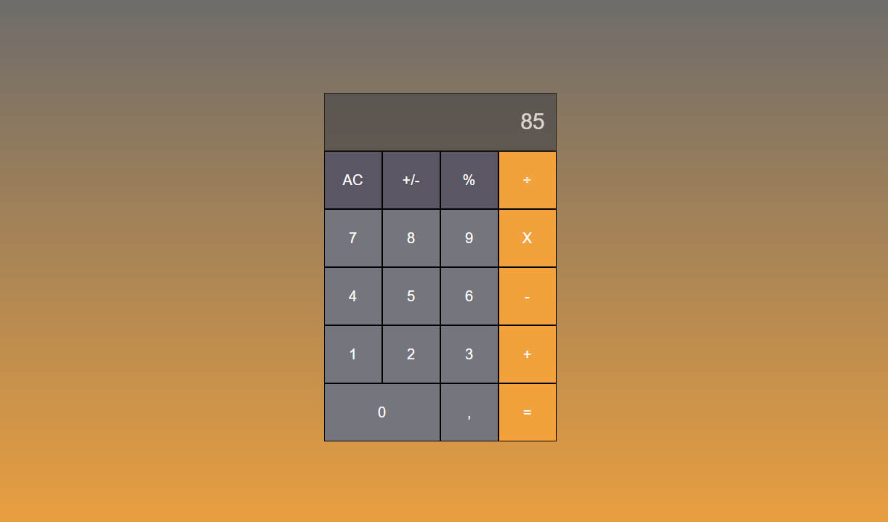

# Grid Calculator

>  A grid calculator made with HTML, CSS and JavaScript.

Confira a aplicação: https://github.com/wandersondefariasprogramador/
/calculator.js/

## 🚀 Technologies

Esse projeto foi desenvolvido com as seguintes tecnologias:

- HTML5
- CSS3
- JavaScript

## 🤝 Colaboradores

Agradecemos às seguintes pessoas que contribuíram para este projeto:

<table>
  <tr>
    <td align="center">
      <a href="#">
         
        
          <b>WANDERSON DE FARIAS</b>
        
      </a>
    </td>
  </tr>
</table>

## 📝 Licença

Esse projeto está sob licença. Veja o arquivo [LICENÇA](LICENSE.md) para mais detalhes.
